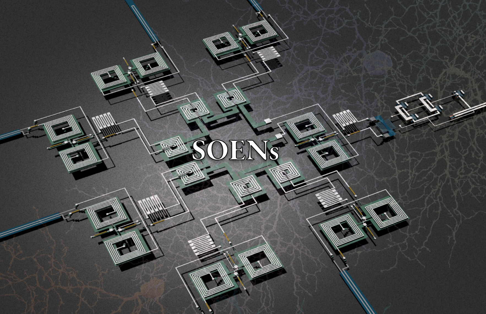
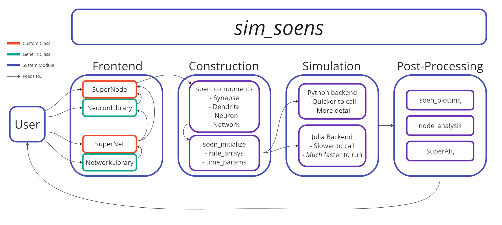
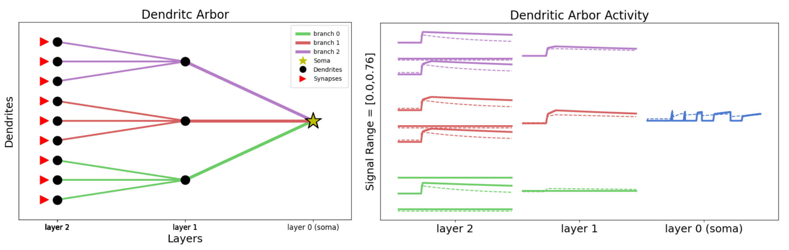

# The *Slim* Simulator for Superconducting Optoelectronic Networks

Superconducting Optoelectronic Networks (SOENs) are an in-development neuromorphic hardware that offer *lightspeed communication* and *brain-level scalability*.\
This repo is for the coders, neuroscientists, and machine-learners that want to play with the computational properties of SOENs through simulations, based on the phenomological model linked here:
 - https://arxiv.org/abs/2210.09976

For the interested hardware afficianados and device physicists, explanatory materical can be found:
 - https://aip.scitation.org/doi/full/10.1063/1.5096403

Enjoy!

## Getting Started
 - Clone this repo
   - `git clone https://github.com/ryangitsit/sim_soens.git` 
 - Be sure to have the necessary python packages with the following commands (setup for python v3.10 -- may have to manually add packages otherwise)
   - `pip install -r requirements.txt` 
 - Open `tutorials/overview.ipynb` for a simulator walkthrough 
   - How to use jupyter notebooks: https://www.dataquest.io/blog/jupyter-notebook-tutorial/
   - Or just use the jupyter extension in the vscode IDE
 - Read the docs!
   - https://sim-soens.readthedocs.io/en/latest/

<!-- ## System Flow

## Features
 - Neurons
   - Any possible SOEN neuron morphology can be called through the `SuperNode` class
   - Generic neurons callable from the `NeuronLibrary`
 - Networking
   - Hand craft networks with specified connectivity using `SuperNet` 
   - Or call on pre-made nets with `NetworkLibrary`
 - Input
   - Custom input with `SuperInput`
   - Canonical datasets can be called natively using `InputLibrary`
     - Random
     - Defined
     - Neuromorphic MNIST
     - Saccade MNIST
 - Visualization tools
   - Neuron morphologies
   - Dendrite behavior
   - Network structure and activity
 -->
# *Enjoy!*
